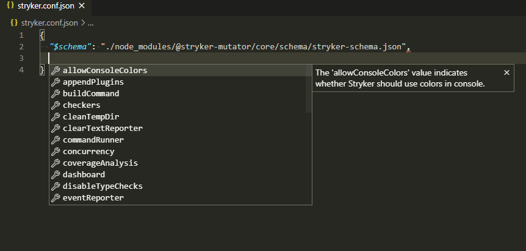

Although a config file is not mandatory, it is recommended. You can define your Stryker configuration in either a `.js` or `.json` file. If you use a `.js` file, it should contain a NodeJS module that exports the configuration object. Autocompletion is supported using JSON schema or using [`@type` JS docs](https://jsdoc.app/).

## Configuration options

See [configuration](./configuration.md) for a list of available options.

## Setup

With a `stryker.conf.json`:

```json
{
  "$schema": "./node_modules/@stryker-mutator/core/schema/stryker-schema.json",
  "_comment": "Comments can be put inside `xxx_comment` properties."
}
```

Or as `stryker.conf.js`:

```js
/**
* @type {import('@stryker-mutator/api/core').StrykerOptions}
*/
module.exports = {
  // Your config here
};
```

You can use your editor's autocompletion to help you author your configuration file.



## Usage

By default, Stryker will look for a "stryker.conf.js" or "stryker.conf.json" file in the current working directory (cwd). You can also use a different configuration file with a second argument to the `run` command.

```shell
# Use "stryker.conf.js" or "stryker.conf.json" in the cwd
npx stryker run
# Use "alternative-stryker.conf.json"
npx stryker run alternative-stryker.conf.json
```

## Glob patterns

Some options allow for a glob pattern to be defined. These glob patterns are defined relative to the cwd. 

For example, using `"mutate": [ "src/components/**/*.component.js" ]` will make sure only files ending with ".component.js" in the "src/components" directory are mutated.

We suggest using [https://globster.xyz/](https://globster.xyz/) when auditing more complex glob expressions; it can help you get them just right.

## Example

The following is an example `stryker.conf.json` file. It specifies running mocha tests with the mocha test runner.

```json
{
  "$schema": "./node_modules/@stryker-mutator/core/schema/stryker-schema.json",
  "testRunner": "mocha",
  "coverageAnalysis": "perTest"
}
```
