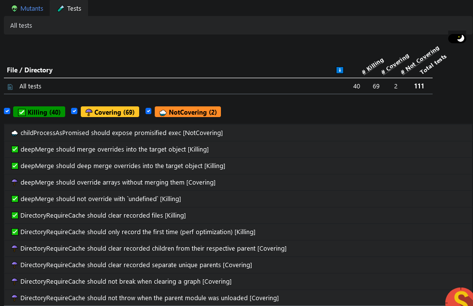
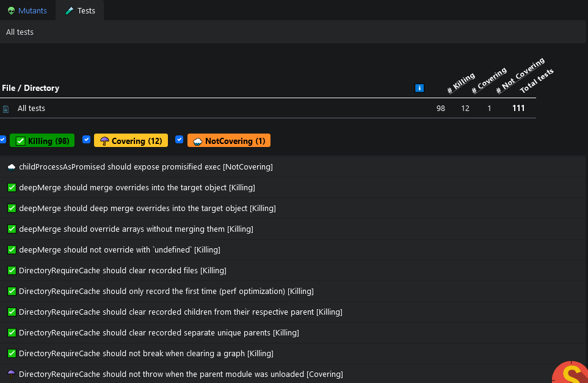

This page describes the available configuration options in Stryker's core package. Please keep in mind that your plugins might also need configuration, see your plugin's configuration page for that.

## Command Line vs. Config File

All configuration options can either be set via the command line or via a [config file](./config-file.md#usage).
Keep in mind, that each option used on the command line will **completely replace** (**not** supplement !) whatever is defined in the [config file](./config-file.md) for this particular parameter.

## Usage of Globbing Expressions on options

The [`ignorePatterns`](#ignorepatterns-string), [`mutate`](#mutate-string) and other options referring to source files support globbing expressions using [node glob](https://github.com/isaacs/node-glob). See [the config file documentation](./config-file.md#glob-patterns) for more information. We suggest using [https://globster.xyz/](https://globster.xyz/) or referring to [`.gitignore`-style glob pattern](https://git-scm.com/docs/gitignore#_pattern_format).
when auditing more complex glob with `*` or `**` expressions; it can help you get them just right.

When used on the **command line**, you need to 'escape' not only the stars `*`, `**`, but also alls strings that contain `!`, `?`, `+` `[]`, `()` and `@` in order to prevent your shell from expanding on them. For example, if you use `bash` or MS-Windows `cmd` or `powershell` as you shell, you need to use double quotes, backslash or other methods to prevent the shell from doing so.

## Configuration Options

### `allowConsoleColors` [`boolean`]

Default: `true`<br />
Command line: `--allowConsoleColors true`<br />
Config file: `"allowConsoleColors": true`

The `allowConsoleColors` value indicates whether Stryker should use colors in console.

### `allowEmpty` [`boolean`]

_(since Stryker 7.0)_

Default: `false`<br />
Command: `--allowEmpty`<br />
Config file: `"allowEmpty": true`

By default test runner will exit with the `No tests found error` when there were no tests executed during the initial dry run. The error encourages you to verify your Stryker configuration if there are indeed no related tests to the given mutate option. By setting this option to true, it prevents the test runner to exit with an error in such cases.

### `appendPlugins` [`string[]`]

Default: `[]`<br />
Command line: `--appendPlugins my_plugin`<br />
Config file: `"appendPlugins": ["my_plugin"]`

A list of additional plugins you want Stryker to load (`require`) without overwriting the (default) `plugins`.

### `buildCommand` [`string`]

Default: `undefined`<br />
Command line: `[-b|--buildCommand] "npm run build"`<br />
Config file: `"buildCommand": 'npm run build'`

Configure a build command to run after mutating the code, but before mutants are tested. This is generally used to transpile your code before testing.
Only configure this if your test runner doesn't take care of this already and you're not using just-in-time transpiler like `babel/register` or `ts-node`.

### `checkers` [`string[]`]

Default: `[]`<br />
Command line: `--checkers typescript`<br />
Config file: `"checkers": ["typescript"]`

Enable checker plugins here. A checker plugin will be invoked for each mutant before it is run in a test runner. It can check to see of a given mutant is valid, by for example validate that it won't result in a type error.

See [typescript-checker](./typescript-checker.md) for an example of a checker plugin.

### `checkerNodeArgs` [`string[]`]

Default: `[]`<br />
Command line: `--checkerNodeArgs "--inspect-brk --cpu-prof"`<br />
Config file: `"checkerNodeArgs": ["--inspect-brk", "--cpu-prof"]`

Configure arguments to be passed as exec arguments to the checker child process. For example, running Stryker with `--concurrency 1 --checkerNodeArgs "--inspect-brk"` will allow you to debug the checker child process. See `execArgv` of [`child_process.fork`](https://nodejs.org/api/child_process.html#child_process_child_process_fork_modulepath_args_options).

### `cleanTempDir` [`boolean | 'always'`]

<details>

<summary>History</summary>

| Version | Changes                     |
| ------- | --------------------------- |
| 7.0     | Added the `'always'` option |

</details>

Default: `true`<br />
Command line: `--cleanTempDir false`<br />
Config file: `"cleanTempDir": false`

Choose whether or not to clean the temp dir (which is ".stryker-tmp" inside the current working directory by default).

- `false`: Never delete the temp dir;
- `true`: Delete the tmp dir after a successful run;
- `'always'`: Always delete the temp dir, regardless of whether the run was successful.

### `clearTextReporter` [`ClearTextOptions`]

Default: `{ "allowColor": true, "allowEmojis": false, "logTests": true, "maxTestsToLog": 3, "reportTests": true, "reportMutants": true, "reportScoreTable": true }`<br />

Config file:

```json
{
  "clearTextReporter": {
    "allowColor": true,
    "allowEmojis": false,
    "logTests": true,
    "maxTestsToLog": 3,
    "reportTests": true,
    "reportMutants": true,
    "reportScoreTable": true
  }
}
```

Settings for the `clear-text` reporter.

### `concurrency` [`number`]

Default: `cpuCoreCount <= 4? cpuCoreCount : cpuCoreCount - 1`<br />
Command line: `--concurrency 4`<br />
Config file: `"concurrency": 4`

Set the concurrency of workers. This defaults to `n-1` where `n` is the number of logical CPU cores available on your machine, unless `n <= 4`, in that case it uses `n`. This is a sane default for most use cases.

### `commandRunner` [`object`]

Default: `{ command: 'npm test' }`<br />
Command line: _none_<br />
Config file: `"commandRunner": { "command": "npm run mocha" }`

With `commandRunner`, you can specify the command to execute for running tests.

### `coverageAnalysis` [`string`]

Default: `perTest`<br />
Command line: `--coverageAnalysis perTest`<br />
Config file: `"coverageAnalysis": "perTest"`

_Note:_ The default changed from `"off"` to `"perTest"` in Stryker v5.

With `coverageAnalysis` you specify which coverage analysis strategy you want to use.

Stryker can analyze mutant coverage results. Doing this can speed up mutation testing because Stryker then decides to run only the exact tests covering the mutant it is testing (instead of running them all).
This performance optimization does _not_ influence the resulting mutation testing score but does allow Stryker to distinguish between "Survived" and "NoCoverage".

All official test runner plugins (`@stryker-mutator/mocha-runner`, `@stryker-mutator/jasmine-runner`, `@stryker-mutator/karma-runner` and `@stryker-mutator/jest-runner`)
support coverage analysis, except for the `command` test runner, since Stryker will just run your command has no way of knowing more about your tests.

The possible values are:

- **off**: Stryker does no optimization. All tests are executed for each mutant.
- **all**: Stryker will determine the mutants covered by your tests during the initial test run phase. Mutants without code coverage will be reported with `NoCoverage` and will not be tested. This requires your test runner plugin to report code coverage back to Stryker.
- **perTest**: Stryker will determine which tests cover which mutant during the initial test run phase. Only the tests that cover a specific mutant are executed for each mutant. Your tests should be _able to run independently of each other and in random order_. Stryker will determine which mutants are _static_ and will run all tests for them during mutation testing. A mutant is 'static' when it is executed during the loading of the file rather than during a test.

### `dashboard` [`DashboardOptions`]

Default: `{ baseUrl: 'https://dashboard.stryker-mutator.io/api/reports', reportType: 'mutationScore' }`<br />
Command line:

- `--dashboard.project github.com/my-org/my-project --dashboard.version branch-or-tag`
- `--dashboard.module my-module`
- `--dashboard.baseUrl https://dashboard.stryker-mutator.io/api/reports`
- `--dashboard.reportType full`

Config file:

```json
{
  "dashboard": {
    "project": "github.com/my-org/my-project",
    "version": "branch-or-tag",
    "module": "my-module",
    "baseUrl": "https://dashboard.stryker-mutator.io/api/reports",
    "reportType": "full"
  }
}
```

Settings for the `dashboard` [reporter](#reporters-string). See the [dashboard documentation](../General/dashboard.md) for more info.

### `disableBail` [`boolean`]

_Since v5.4_

Default: `false`<br />
Command: `--disableBail`<br />
Config file: `"disableBail": true`

Configure the test runner to report all failing tests when a mutant is killed instead of bailing after the first failing test. Bailing brings better performance, but you might be interested in the full report instead. This might be useful when using the "Tests" view to hunt for tests that don't kill a single mutant.

See the difference of bail vs no bail on StrykerJS's utils package (with `--concurrency 4`):

| With bail (in 2m 33s)                              | Disable bail (in 2 m 45s)                                |
| -------------------------------------------------- | -------------------------------------------------------- |
|  |  |

As you can see, when you disable bail, a lot more tests get the "Killing" status, meaning that they killed at least 1 mutant. This does come with a performance penalty of 12s in this example.

_Note: Disable bail needs to be supported by the test runner plugin in order to work. All official test runner plugins (`@stryker-mutator/xxx-runner`) support this feature except for Jest. Jest always runs without --bail (see [#11766](https://github.com/facebook/jest/issues/11766)) inside Stryker, however it will report only the first failing test when disableBail=false and all failing tests when disableBail=true_

### `disableTypeChecks` [`boolean` | `string`]


<details>

<summary>History</summary>

| Version | Changes                     |
| ------- | --------------------------- |
| 7.0     | Default changed from `"{test,src,lib}/**/*.{js,ts,jsx,tsx,html,vue}"` to `true` |

</details>

Default: `true`<br />
Command: _none_<br />
Config file: `"disableTypeChecks": false`

Set to `true` to disable type checking, or `false` to enable it. For more control, configure a pattern that matches the files of which type checking has to be disabled, for example: `"{test,src,lib}/**/*.{js,ts,jsx,tsx}"`. Setting it to `true` will disable type checking for all TypeScript-ish files (currently *.ts, *.js, *.tsx, *.jsx, *.mjs, *.mts, *.cts, *.cjs, *.html and *.vue files).

Disabling type checking is needed because Stryker will create (typescript) type errors when inserting the mutants in your code. Stryker disables type checking by inserting `// @ts-nocheck` atop those files and removing other `// @ts-xxx` directives (so they won't interfere with `@ts-nocheck`).


### `dryRunOnly` [`boolean`]

Default: `false`<br />
Command line: `--dryRunOnly`<br />
Config file: `"dryRunOnly": false`

Execute the initial test run only without doing actual mutation testing. Dry run only will still mutate your code before doing the dry run without those mutants being active, thus can be used to test that StrykerJS can run your test setup. This can be useful, for example, in CI pipelines.

### `dryRunTimeoutMinutes` [`number`]

Default: `5`<br />
Command line: `--dryRunTimeoutMinutes 5`<br />
Config file: `"dryRunTimeoutMinutes": 5`

Use this option to configure an absolute timeout for the initial test run. Since it can take a while we use minutes as time unit.

### `eventReporter` [`object`]

Default: `{ baseDir: "reports/mutation/events" }`<br />
Command line: _none_<br />
Config file: `"eventReporter": { "baseDir": "coverage/events" }`

The options for the event recorder reporter:

- `baseDir`: The relative base dir to write the events to.

### `fileLogLevel` [`string`]

Default: `off`<br />
Command line: `--fileLogLevel info`<br />
Config file: `"fileLogLevel": "info"`<br />

Set the log level that Stryker uses to write to the "stryker.log" file. Possible values: `off`, `fatal`, `error`, `warn`, `info`, `debug` and `trace`

### `force` [`boolean`]

Default: `false`<br />
Command line: `--force`<br />
Config file: `"force": true`<br />

Run all mutants, even if [`incremental`](#incremental-boolean) is provided and an incremental file exists. Can be used to force a rebuild of the incremental file.
See [incremental](./incremental.md#forcing-reruns)

### `htmlReporter` [`object`]

Default: `{ fileName: "reports/mutation.html" }`<br />
Command line: _none_<br />
Config file: `"htmlReporter": { "fileName": "coverage/stryker.html" }`

The options for the html reporter:

- `fileName`: The relative `fileName` of the html report.

### `ignorePatterns` [`string[]`]

Default: `[]`<br />
Command line: `--ignorePatterns dist,coverage`<br />
Config file: `"ignorePatterns": ["dist", "coverage"]`<br />

Specify the patterns to all files or directories that are not used to run your tests and thus should _not be copied_ to the sandbox directory for mutation testing. Each patterns in this array should be a [glob pattern](#usage-of-globbing-expressions-on-options).

These patterns are **always ignored**: `['node_modules', '.git', '*.tsbuildinfo', '/stryker.log']`. The configured files in the `tempDirName`,`incrementalFile`, `htmlReporter.fileName` and `jsonReporter.fileName` options are also ignored.
Because Stryker always ignores these, you should rarely have to adjust the `"ignorePatterns"` setting at all. If you want to undo one of these ignore patterns, you can use the `!` prefix, for example: `["!node_modules"]`.

Overriding `--ignorePatterns` is only needed when you experience a slow Stryker startup, because too many (or too large) files are copied to the sandbox that are not needed to run the tests.
For example, image or movie directories. This is useful to speed up Stryker by ignoring big directories/files you might have in your repo that has nothing to do with your code. For example, 1.5GB of movie/image files.

This option has **no effect at all**, when used in combination with [`--inPlace`](#inplace-boolean).

Note that, to **select specific files to be mutated**, you should use [`mutate`](#mutate-string).

If a glob pattern starts with `/`, the pattern is relative to the current working directory. For example, `/foo.js` matches to `foo.js` but not `subdir/foo.js`.

When using the command line, the list can only contain a comma separated list of globbing expressions.

- `--ignorePatterns ".idea",".angular","/src/assets/*.png","/src/assets/*.jpg"`
- `--ignorePatterns "/src/**/*.css"`
- `--ignorePatterns` with `"!"` (= undo) for example:
  - `--ignorePatterns "src/**","!str/app/important/*.ts"` (for details on usage of glob patterns like `!`, `*`, `**` see [above](#usage-of-globbing-expressions-on-options))
  - or in the config file: `"ignorePatterns": ["src/**","!str/app/important/*.ts"]` This would ignore everything in and below `src` - directory **except** the typescript files in `src/app/important` directory, but the `--mutate` might be the better option in that case, see [below](#mutate-string)
  - Keep in mind that you should **not accidentally ignore any other configuration** files your test runner might need for running the tests in the sandbox directory.

### `ignorers` [`string[]`]

_Since Stryker 7.3_

Default: `[]`<br />
Command line: _none_<br />
Config file: `"ignorers": ["console.debug"]`<br />

Specify which ignore-plugins to use. With an ignore-plugin you can ignore mutants inside common code patterns that you don't want to test for some reason. For example, you can use this to ignore all `console.debug()` statements from being mutated. 

You only specify the name of the plugins here. The plugin's implementation must be loaded using a separate file, which must be listed in your [plugins array](#plugins-string).

See [using an ignore-plugin](./disable-mutants.md#using-an-ignore-plugin) for more information.

### `ignoreStatic` [`boolean`]

Default: `false`<br />
Command line: `--ignoreStatic`<br />
Config file: `"ignoreStatic": true`<br />

Static mutants are mutants which are only executed during the loading of a file. Testing these mutants come with a big performance penalty. Therefore, it might make sense to ignore static mutants altogether.

For example:

```js
const hi = '👋'; // Mutant 👽 StringLiteral

export function greet(name) {
  return `${hi} ${name}`;
}
```

In this example, `'👋'` on line 1 would be mutated to an empty string by the StringLiteral mutator. However, the mutant is only executed _when the file is loaded_, making it a static mutant. It is impossible to measure the exact code coverage per test for the mutant. Therefore, Stryker would default to running all tests.

_Note:_ Enabling `--ignoreStatic` requires `"coverageAnalysis": "perTest"`, because detecting which mutant is static is done during the initial test run and needs per test coverage analysis.

### `incremental` [`boolean`]

Default: `false`<br />
Command line: `--incremental`<br />
Config file: `"incremental": true`<br />

Enable 'incremental mode'. Stryker will store results in a file and use that file to speed up the next `--incremental` run.
See [incremental](./incremental.md) for more details.

### `incrementalFile` [`string`]

Default: `"reports/stryker-incremental.json"`<br />
Command line: `--incrementalFile reports/stryker-incremental-alternative.json`<br />
Config file: `"incrementalFile": "reports/stryker-incremental-alternative.json"`<br />

Specify the file to use for incremental mode.
See [incremental](./incremental.md) for more details.

### `inPlace` [`boolean`]

Default: `false`<br />
Command line: `--inPlace`<br />
Config file: `"inPlace": true`<br />

Determines whether Stryker should mutate your files in place.
Note: mutating your files in place is generally not needed for mutation testing, unless you have a dependency in your project that is really dependent on the file locations (like "app-root-path" for example).

When `true`, Stryker will override your files, but it will keep a copy of the originals in the temp directory (using `tempDirName`) and it will place the originals back after it is done. Also, with `true` the [`ignorePatterns`](#ignorepatterns-string) has no effect anymore.

When `false` (default) Stryker will work in the copy of your code inside the temp directory.

### `jsonReporter` [`object`]

Default: `{ fileName: "reports/mutation/mutation.json" }`<br />
Command line: _none_<br />
Config file: `"jsonReporter": { "fileName": "coverage/stryker.json" }`

The options for the json reporter:

- `fileName`: The relative `fileName` of the json report.

### `logLevel` [`string`]

Default: `info`<br />
Command line: `--logLevel info`<br />
Config file: `"logLevel": "info"`

Set the log level that Stryker uses to write to the console. Possible values: `off`, `fatal`, `error`, `warn`, `info`, `debug` and `trace`

_Note_: Test runners are run as child processes of the Stryker Node process. All output (stdout) of the `testRunner` is logged as `trace`.
Thus, to see logging output from the test runner set the `logLevel` to `all` or `trace`.

### `maxConcurrentTestRunners` (DEPRECATED)

**DEPRECATED**. Please use [concurrency](#concurrency-number) instead.

### `maxTestRunnerReuse` [`number`]

Default: `0`<br />
Command line: `--maxTestRunnerReuse 20`<br />
Config file: `"maxTestRunnerReuse": 20`

Restart each test runner worker process after `n` runs. Not recommended unless you are experiencing memory leaks that you are unable to resolve. Configuring `0` here means infinite reuse.

### `mutate` [`string[]`]

Default: `['{src,lib}/**/*.js?(x)', '!{src,lib}/**/__tests__/**/*.js?(x)', '!{src,lib}/**/?(*.)+(spec|test).js?(x)', '!{src,lib}/**/*+(Spec|Test).js?(x)']`<br />

- Config file: `"mutate": ["src/**/*.js", "a.js"]` or `"mutate": ["src/**/*.ts","!src/**/*.spec.ts","!src/**/*.module.ts"]`
- Command line:
  - `--mutate "src/**/*.js", "a.js"`, `-m "src/**/*.js", "a.js"`
  - `--mutate "src/**/*.ts","!src/**/*.spec.ts","!src/**/*.module.ts"` (For usage of `*`, `**` and other [globbing expressions see above](#usage-of-globbing-expressions-on-options))
  - `--mutate src/app/home/home.component.ts`, for one specific file
  - `--mutate "src/app/home/*.ts","!src/app/home/*.spec.ts"`, if you want to mutate just one specific directory

With `mutate` you configure the subset of files or just one specific file to be mutated. These should be your _production code files_, and definitely not your test files.
(Whereas with [`ignorePatterns`](#ignorepatterns-string) you prevent non-relevant files from being copied to the [sandbox directory](#tempDirName-string) in the first place)

The default will try to guess your production code files based on sane defaults. It reads like this:

- Include all js-like files inside the `src` or `lib` dir
  - Except files inside `__tests__` directories and file names ending with `test` or `spec`.

If the defaults are not sufficient for you, for example in an angular project you might want to **exclude** not only the `*.spec.ts` files but other files too, just like the default already does.

It is possible to specify exactly which code blocks to mutate by means of a _mutation range_. This can be done postfixing your file with `:startLine[:startColumn]-endLine[:endColumn]`. Some examples:

- `"src/app.js:1-11"` will mutate lines 1 through 11 inside app.js.
- `"src/app.js:5:4-6:4"` will mutate from line 5, column 4 through line 6 column 4 inside app.js (columns 4 are included).
- `"src/app.js:5-6:4"` will mutate from line 5, column 0 through line 6 column 4 inside app.js (column 4 is included).

_Note:_ It is **not** possible to combine mutation range with a [globbing expression](#usage-of-globbing-expressions-on-options) in the same line.

### `mutator` [`MutatorDescriptor`]

Default: `{}`<br />
Command line: _none_<br />
Config file: `"mutator": { "plugins": ["classProperties"], "excludedMutations": ["StringLiteral"] }`

- `plugins`: allows you to override the default [babel plugins](https://babeljs.io/docs/en/plugins) to use for JavaScript files.
  By default, Stryker uses [a default list of babel plugins to parse your JS file](https://github.com/stryker-mutator/stryker-js/blob/master/packages/instrumenter/src/parsers/js-parser.ts#L8-L32). It also loads any plugins or presets you might have configured yourself with `.babelrc` or `babel.config.js` files.
  In the rare situation where the plugins Stryker loads conflict with your own local plugins (for example, when using the decorators and decorators-legacy plugins together), you can override the `plugins` here to `[]`.
- `excludedMutations`: allow you to specify a [list of mutator names](https://stryker-mutator.io/docs/mutation-testing-elements/supported-mutators/#supported-mutators) to be excluded (`ignored`) from the test run. See [Disable mutants](./disable-mutants.md) for more options of how to disable specific mutants.

_Note: prior to Stryker version 4, the mutator also needed a `name` (or be defined as `string`). This is removed in version 4. Stryker now supports mutating of JavaScript and friend files out of the box, without the need for a mutator plugin._

### `packageManager` [`string`]

Default: `"npm"`<br />
Command line: _none_<br />
Config file: `"packageManager": "yarn"`

The package manager Stryker can use to install missing dependencies.

### `plugins` [`string[]`]

Default: `['@stryker-mutator/*']`<br />
Command line: `--plugins @stryker-mutator/jasmine-framework,@stryker-mutator/karma-runner`<br />
Config file: `"plugins": ["@stryker-mutator/jasmine-framework", "@stryker-mutator/karma-runner"]`

With `plugins`, you can add additional Node modules for Stryker to load (using `import`).
By default, all `node_modules` starting with `@stryker-mutator/*` will be loaded, so you would normally not need to specify this option.
These modules should be installed right next to stryker. For a current list of plugins,
you can consult [npm](https://www.npmjs.com/search?q=stryker-plugin) or use one of the officially supported plugins.

### `reporters` [`string[]`]

Default: `['clear-text', 'progress', 'html']`<br />
Command line: `--reporters clear-text,progress,dots,dashboard,html,json`<br />
Config file: `"reporters": ["clear-text", "progress", "dots", "dashboard", "html", "json"]`

Set the reporters for Stryker to use. These reporters can be used out of the box: `html`, `json`, `progress`, `clear-text`, `dots`, `dashboard` and `event-recorder`.
By default, `clear-text`, `progress`, `html` are active if no reporters are configured. See [reporter plugins](./plugins.md#reporters)
for a full description of each reporter.

You can also add your custom reporter using a [reporter plugin](./plugins.md#reporters)

To configure specific reporters, see their configuration:

- [clearTextReporter](#cleartextreporter-cleartextoptions)
- [dashboard](#dashboard-dashboardoptions)
- [htmlReporter](#htmlreporter-object)
- [jsonReporter](#jsonreporter-object)

### `symlinkNodeModules` [`boolean`]

Default: `true`<br />
Command line: _none_<br />
Config file: `"symlinkNodeModules": true`

The `symlinkNodeModules` value indicates whether Stryker should create a [symbolic link](https://nodejs.org/api/fs.html#fs_fs_symlink_target_path_type_callback)
to your current node_modules directory in the sandbox directories. This makes running your tests by Stryker behave
more like your would run the tests yourself in your project directory.
Only disable this setting if you really know what you are doing.

For example, [Jest](https://jestjs.io/) expects any plugins to be located at "./node_modules/..."
in the Sandbox directory. Another example can be running [karma](http://karma-runner.github.io/) tests where
you specify files from the 'node_modules/angular/...'. Without symlinking the
node_modules directory this would not be possible.

Stryker will look for the node_modules directory to use in the current basePath (or current working directory) and
its parent directories.

### `tempDirName` [`string`]

Default: `'.stryker-tmp'`<br />
Command line: `--tempDirName .stryker-tmp`<br />
Config file: `"tempDirName": '.stryker-tmp'`

Choose a different temp dir that Stryker uses for mutation testing. This directory will contain copies of your source code during a mutation test run.
It will be created if it not exists and is **entirely deleted** after a successful run, so change this with caution.

It is advised to use a directory inside the directory that holds your repository. This way `node_modules` are resolved as expected. Be sure to
not check-in your chosen temp directory in your `.gitignore` file.

### `testFramework` (DEPRECATED)

_Note: Use of "testFramework" is no longer needed. You can remove it from your configuration. Your test runner plugin now handles its own test framework integration_

### `testRunner` [`string`]

Default: `'command'`<br />
Command line: `--testRunner karma`<br />
Config file: `"testRunner": "karma"`

With `testRunner` you specify the test runner that Stryker uses to run your tests. The default value is `command`. The command runner runs a configurable bash/cmd command and bases the result on the exit code of that program (0 for success, otherwise failed). You can configure this command via the config file using the `commandRunner: { command: 'npm run mocha' }`. It uses `npm test` as the command by default.

The command test runner can be made to work in any use case, but comes with a performance
penalty, as Stryker cannot do any optimizations and just runs all tests for all mutants.
If possible, you should try to use one of the test runner plugins that hook into your test runner of choice.
For example: install and use the `@stryker-mutator/karma-runner` to use `karma` as a test runner.

### `testRunnerNodeArgs` [`string[]`]

Default: `[]`<br />
Command line: `--testRunnerNodeArgs "--inspect-brk --cpu-prof"`<br />
Config file: `"testRunnerNodeArgs": ["--inspect-brk", "--cpu-prof"]`

Configure arguments to be passed as exec arguments to the test runner child process. For example, running Stryker with `--timeoutMS 9999999 --concurrency 1 --testRunnerNodeArgs "--inspect-brk"` will allow you to debug the test runner child process. See `execArgv` of [`child_process.fork`](https://nodejs.org/api/child_process.html#child_process_child_process_fork_modulepath_args_options).

### `thresholds` [`object`]

Default: `{ high: 80, low: 60, break: null }`<br />
Command line: _none_<br />
Config file: `"thresholds": { "high": 80, "low": 60, "break": null }`

Specify the thresholds for mutation score.

- `mutation score >= high`: Awesome! Reporters should color this green and happy.
- `high > mutation score >= low`: Warning! Reporters should color this orange/yellow. Watch yourself!
- `mutation score < low`: Danger! Reporters should color this in red. You're in danger!
- `mutation score < break`: Error! Stryker will exit with exit code 1, indicating a build failure. No consequence for reporters, though.

It is not allowed to only supply one value of the values (it's all or nothing). However, `high` and `low` values can be the same, making sure colors are either red or green. Set `break` to `null` (default) to never let your build fail.

### `timeoutFactor` [`number`]

Default: `1.5`<br />
Command line: `--timeoutFactor 1.5`<br />
Config file: `"timeoutFactor": 1.5`

See [Timeout in milliseconds](#timeoutms-number).

### `timeoutMS` [`number`]

Default: `5000`<br />
Command line: `--timeoutMS 5000`<br />
Config file: `"timeoutMS": 5000`

When Stryker is mutating code, it cannot determine indefinitely whether a code mutation results in an infinite loop (see [Halting problem](https://en.wikipedia.org/wiki/Halting_problem)).
In order to battle infinite loops, a test run gets killed after a certain period of time. This period is configurable with two settings: `timeoutMS` and `timeoutFactor`.
To calculate the actual timeout in milliseconds the, following formula is used:

```
timeoutForTestRunMs = netTimeMs * timeoutFactor + timeoutMS + overheadMs
```

Both `netTimeMs` and `overheadMs` are calculated during the initial test run. They are logged on `info` level. For example when `overheadMs` is 92 and `netTimeMs` is 5: `Initial test run succeeded. Ran 6 tests in 4 seconds (net 5 ms, overhead 92 ms).`

With `timeoutFactor` you can configure the allowed deviation relative to the time of a normal test run. Tweak this if you notice that mutants are prone to creating slower code, but not infinite loops.
`timeoutMS` lets you configure an absolute deviation. Use it, if you run Stryker on a busy machine and you need to wait longer to make sure that the code indeed entered an infinite loop.

### `transpilers` (DEPRECATED)

_Note: Support for "transpilers" plugins is removed since Stryker 4. You can now configure your own [buildCommand](#buildCommand-string)_

### `tsconfigFile` [`string`]

Default: `"tsconfig.json"`<br />
Command line: _none_<br />
Config file: `"tsconfigFile": "typescript.config.json"`

Configure the (root) tsconfig file for typescript projects. This will allow Stryker to rewrite the `extends` and `references` settings in this and related tsconfig files in your sandbox. Defaults to `tsconfig.json`. This setting is also used when you enable the `@stryker-mutator/typescript-checker plugin`.

### `warnings` [`boolean` or `object`]

Default: `true`<br />
Command line: _none_<br />
Config file: `"warnings": { "slow": false }`

Enable or disable certain warnings:

- `true`: Enable all warnings.
- `false`: Disable all warnings.
- An object to specify:
  - `unknownOptions`: Decide whether or not to log warnings when additional stryker options are configured.
  - `preprocessorErrors`: Decide whether or not to log warnings when a preprocessor error occurs. For example, when the disabling of type errors fails.
  - `unserializableOptions`: Decide whether or not to log warnings when a configuration options are unserializable. For example, using a `/regex/` or `function` in your configuration options.
  - `slow`: Decide whether or not to log warnings when Stryker detects a slow part of mutation that can be sped up by changing some configuration. For example using `--ignoreStatic`.
