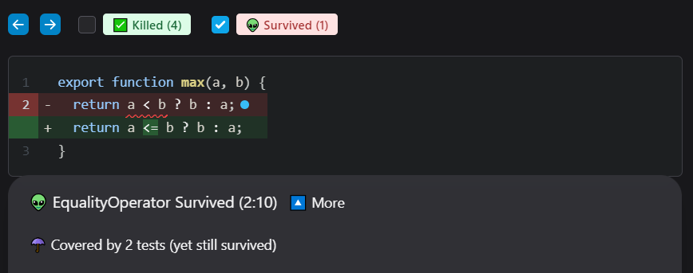
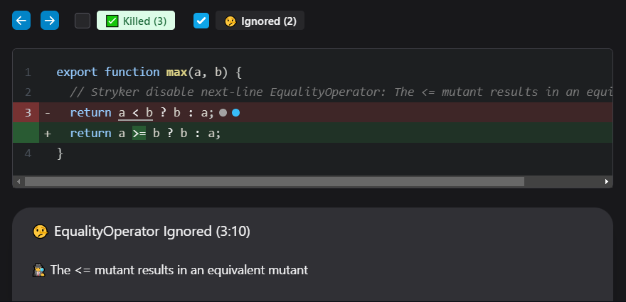

During mutation testing, you might run into [equivalent mutants](../mutation-testing-elements/equivalent-mutants) or simply mutants that you are not interested in.

## An example

Given this code:

```js
function max(a, b) {
  return a < b ? b : a;
}
```

And these tests:

```js
describe('math', () => {
  it('should return 4 for max(4, 3)', () => {
    expect(max(4, 3)).eq(4);
  });
  it('should return 4 for max(3, 4)', () => {
    expect(max(3, 4)).eq(4);
  });
});
```

Stryker will generate (amongst others) these mutants:

```diff
function max(a, b) {
-  return a < b ? b : a;
+  return true ? b : a; // 👽 1
+  return false ? b : a; // 👽 2
+  return a <= b ? b : a; // 👽 3
}
```

Mutant 1 and 2 are killed by the tests. However, mutant 3 isn't killed. In fact, mutant 3 _cannot be killed_ because the mutated code is equivalent to the original. It is therefore called _equivalent mutant_.



## Disable mutants

StrykerJS supports 2 ways to disable mutants.

1. [Exclude the mutator](#exclude-the-mutator).
2. [Using a `// Stryker disable` comment](#using-a--stryker-disable-comment).

Disabled mutants will still end up in your report, but will get the `ignored` status. This means that they don't influence your mutation score, but are still visible if you want to look for them. This has no impact on the performance of mutation testing.

## Exclude the mutator

You can simply disable the mutator entirely. This is done by stating the mutator name in the `mutator.excludedMutations` array in your stryker configuration file:

```json
{
    "mutator": {
        "excludedMutations": ["EqualityOperator"]
  }
}
```

The mutator name can be found in the clear-text or html report. 

If you've enabled the clear-text reporter (enabled by default), you can find the mutator name in your console:

```
#3. [Survived] EqualityOperator
src/math.js:3:12
-       return a < b ? b : a;
+       return a <= b ? b : a;
Tests ran:
    math should return 4 for max(4, 3)
    math should return 4 for max(3, 4)
```

In the html report, you will need to select the mutant you want to ignore, the drawer at the bottom has the mutator name in its title.

However, disable the mutator for all your files is kind of a shotgun approach. Sure it works, but the mutator is now also disabled for other files and places. You probably want to use a comment instead.

## Using a `// Stryker disable` comment.

_Available since Stryker 5.4_

You can disable Stryker for a specific line of code using a comment.


```js
function max(a, b) {
    // Stryker disable next-line all
  return a < b ? b : a;
}
```

After running Stryker again, the report looks like this:


This works, but is not exactly what we want. As you can see, all mutants on line 4 are now disabled. 

We can do better by specifying which mutator we want to ignore:

```js
function max(a, b) {
    // Stryker disable next-line EqualityOperator
  return a < b ? b : a;
}
```

We can even provide a custom reason for disabling this mutator behind a colon (`:`). This reason will also end up in your report (drawer below)

```js
function max(a, b) {
    // Stryker disable next-line EqualityOperator: The <= mutant results in an equivalent mutant
  return a < b ? b : a;
}
```

After running Stryker again, the report looks like this:



## Disable comment syntax

_Available since Stryker 5.4_

The disabled comment is pretty powerful. Some more examples:

Disable an entire file:

```js
// Stryker disable all
function max(a, b) {
  return a < b ? b : a;
}
```

Disable parts of a file:

```js
// Stryker disable all
function max(a, b) {
    return a < b ? b : a;
}
// Stryker restore all
function min(a, b) {
  return a < b ? b : a;
}
```

Disable 2 mutators for an entire file with a custom reason:

```js
// Stryker disable EqualityOperator,ObjectLiteral: We'll implement tests for these next sprint
function max(a, b) {
  return a < b ? b : a;
}
```

Disable all mutators for an entire file, but restore the EqualityOperator for 1 line:

```js
// Stryker disable all
function max(a, b) {
  // Stryker restore EqualityOperator
  return a < b ? b : a;
}
```

The syntax looks like this:

```
// Stryker [disable|restore] [next-line] *mutatorList*[: custom reason]
```

The comment always starts with `// Stryker`, followed by either `disable` or `restore`. Next, you can specify whether or not this comment targets the `next-line`, or all lines from this point on. The next part is the mutator list. This is either a comma separated list of mutators, or the "all" text signaling this comment targets all mutators. Last is an optional custom reason text, which follows the colon.

