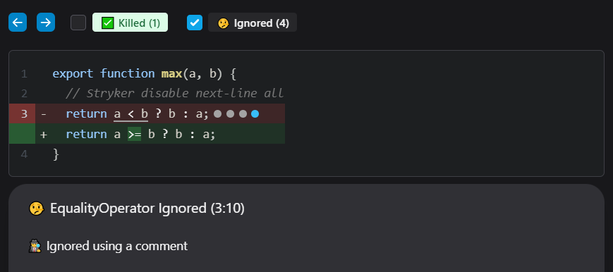

During mutation testing, you might run into [equivalent mutants](../mutation-testing-elements/equivalent-mutants.md) or simply mutants that you are not interested in.

## An example

Given this code:

```js
function max(a, b) {
  return a < b ? b : a;
}
```

And these tests:

```js
describe('math', () => {
  it('should return 4 for max(4, 3)', () => {
    expect(max(4, 3)).eq(4);
  });
  it('should return 4 for max(3, 4)', () => {
    expect(max(3, 4)).eq(4);
  });
});
```

Stryker will generate (amongst others) these mutants:

```diff
function max(a, b) {
-  return a < b ? b : a;
+  return true ? b : a; // 👽 1
+  return false ? b : a; // 👽 2
+  return a <= b ? b : a; // 👽 3
}
```

Mutant 1 and 2 are killed by the tests. However, mutant 3 isn't killed. In fact, mutant 3 _cannot be killed_ because the mutated code is equivalent to the original. It is therefore called _equivalent mutant_.


## Disable mutants

StrykerJS supports three ways to ignore mutants.

1. [Exclude the mutator](#exclude-the-mutator).  
   If you are not interested in a specific mutator.
2. [Using a `// Stryker disable` comment](#using-a--stryker-disable-comment).  
   Suitable for the one-off ignoring of mutants.
3. [Using an ignore-plugin](#using-an-ignore-plugin).  
   If you want to ignore the same pattern multiple times (and in multiple files).

Disabled mutants will remain in your report but will get the `ignored` status. Mutants with this status in your report don't influence your mutation score but are still visible if you want to look for them.

## Exclude the mutator

You can turn off a mutator entirely. Do this by stating the mutator name in the `mutator.excludedMutations` array in your Stryker configuration file:

```json
{
  "mutator": {
    "excludedMutations": ["EqualityOperator"]
  }
}
```

You can look up the mutator name inside your clear-text- or HTML report. For example, using the clear-text reporter (enabled by default), you can find the mutator name in your console:

```
#3. [Survived] EqualityOperator
src/math.js:3:12
-       return a < b ? b : a;
+       return a <= b ? b : a;
Tests ran:
    math should return 4 for max(4, 3)
    math should return 4 for max(3, 4)
```

In the HTML report, you must select the mutant you want to ignore; the drawer at the bottom has the mutator name in its title.

However, excluding a mutator for all your files is a shotgun approach; it works but is now also disabled for other files and places. You may want to use a comment instead.

## Using a `// Stryker disable` comment.

_Available since Stryker 5.4_

You can disable Stryker for a specific line of code using a comment.

```js
function max(a, b) {
  // Stryker disable next-line all
  return a < b ? b : a;
}
```

After rerunning Stryker, the report looks like this:



It works but is different from what we want. As you can see, all mutants on line 4 are now disabled.

We can do better by naming the mutator we want to ignore:

```js
function max(a, b) {
  // Stryker disable next-line EqualityOperator
  return a < b ? b : a;
}
```

We can even provide a custom reason for disabling this mutant behind a colon (`:`). Disable reasons _will also end up in your report_ (drawer below).

```js
function max(a, b) {
  // Stryker disable next-line EqualityOperator: The <= mutant results in an equivalent mutant
  return a < b ? b : a;
}
```

After rerunning Stryker, the report looks like this:


## Disable comment syntax

_Available since Stryker 5.4_

The disabled comment is pretty powerful. Some more examples:

Disable an entire file:

```js
// Stryker disable all
function max(a, b) {
  return a < b ? b : a;
}
```

Disable parts of a file:

```js
// Stryker disable all
function max(a, b) {
  return a < b ? b : a;
}
// Stryker restore all
function min(a, b) {
  return a < b ? b : a;
}
```

Disable 2 mutators for an entire file with a custom reason:

```js
// Stryker disable EqualityOperator,ObjectLiteral: We'll implement tests for these next sprint
function max(a, b) {
  return a < b ? b : a;
}
```

Turn off all mutators for an entire file, but restore the `EqualityOperator` for 1 line:

```js
// Stryker disable all
function max(a, b) {
  // Stryker restore next-line EqualityOperator
  return a < b ? b : a;
}
```

The syntax looks like this:

```
// Stryker [disable|restore] [next-line] *mutatorList*[: custom reason]
```

The comment always starts with `// Stryker`, followed by either `disable` or `restore`. Next, you can specify whether this comment targets the `next-line` or all lines from this point on (by not using `next-line`). As for the mutator list, this is either a comma-separated list of mutators or `all` to signal this comment targets all mutators. Last is an optional custom reason text behind the `:` colon.

## Using an ignore-plugin

_Available since Stryker 7.3_

You might not be interested in testing specific code patterns in some projects. You can use `// Stryker disable` comments for these. However, this gets tedious quickly.

For example:

```js
function add(a, b) {
  console.debug('add called');
  return a + b;
}
function subtract(a, b) {
  console.debug('subtract called');
  return a + b;
}
```

In the code above, you might want to ignore all mutants in `console.debug` statements in this code. This is where an ignore-plugin can help.

To declare an ignore-plugin, first install `@stryker-mutator/api` as a dev dependency:

```
npm i -D @stryker-mutator/api
```

Now add a "stryker-console-ignorer.js" to your project:

```js
// stryker-console-ignorer.js
import { PluginKind, declareValuePlugin } from '@stryker-mutator/api/plugin';

export const strykerPlugins = [declareValuePlugin(PluginKind.Ignore, 'console.debug', {
  shouldIgnore(path) {
    // Define the conditions for which you want to ignore mutants
    if (
      path.isExpressionStatement() &&
      path.node.expression.type === 'CallExpression' &&
      path.node.expression.callee.type === 'MemberExpression' &&
      path.node.expression.callee.object.type === 'Identifier' &&
      path.node.expression.callee.object.name === 'console' &&
      path.node.expression.callee.property.type === 'Identifier' &&
      path.node.expression.callee.property.name === 'debug'
    ) {
      // Return the ignore reason
      return "We're not interested in testing `console.debug` statements, see ADR 648.";
    }
  }
})];
```

In the above example, you declare an ignore-plugin with the name `'console.debug'` and an `Ignorer`. An `Ignorer` is an object with a `shouldIgnore(path)` method. Stryker will execute this method on each node of the abstract syntax tree (AST). To ignore mutants in the current node and child nodes, return a non-empty ignore reason as a string here. The `path` parameter is a babel `NodePath` object, [see 'visiting' in the babel handbook](https://github.com/jamiebuilds/babel-handbook/blob/master/translations/en/plugin-handbook.md#user-content-visiting) for more information on the `NodePath` API.

You configure this plugin in your 'stryker.config.json' file:

```json
{
  "ignorers": ["console.debug"],
  "plugins": ["@stryker-mutator/*", "./stryker-console-ignorer.js"]
}
```

After rerunning Stryker, your report will look like this.


:::tip

If you want TypeScript type-safety on the `path` being passed into your ignore-plugin, you will need to install the babel types yourself: `npm i -D @types/babel__core` and add this TypeScript file somewhere in your project:

```ts
/// <reference types="@stryker-mutator/api/ignore" />
import type babel from '@babel/core';

declare module '@stryker-mutator/api/ignore' {
  export interface NodePath extends babel.NodePath {}
}
```

If you want to write the plugin itself as TypeScript as well, you will need to transpile it to JavaScript yourself. Either by doing it before you run Stryker, or using a just-in-time compiler like `ts-node`.

:::
