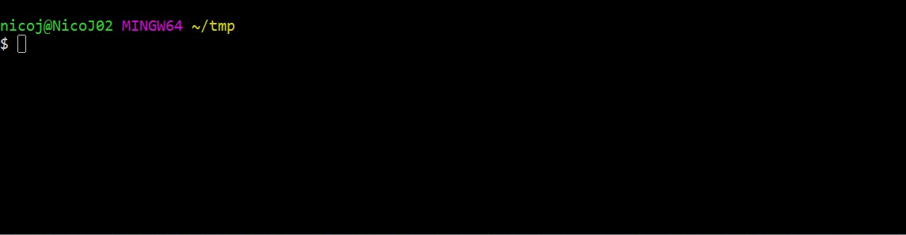

Install Stryker using [npm](https://nodejs.org).



## 1 Prepare

Make sure you have npm and nodejs installed. Open a terminal / command prompt and cd to the root of your project you want to mutation test.

```bash
cd my-project
```

---

## 2 Install

The easiest way to get started with Stryker is by using the `npm init stryker` command.

```bash
npm init stryker
```

This command will first install Stryker and then run the Stryker initializer. During the initialization, you'll be asked a series of questions to help set up Stryker for your project.

If you're asked to install Stryker, choose **Yes**.

After the init is done, inspect the `stryker.config.mjs` file.

For more information on what these options mean, take a look at [the Configuration docs page](./configuration.md)

---

## 3 Let's kill some mutants

Run Stryker to mutation test your project

```bash
npx stryker run
```

Have troubles running Stryker? Try running with trace logging. You can also take a look at our [troubleshooting guide](./troubleshooting.md).

```bash
npx stryker run --logLevel trace
```

You can also have a look at [the Configuration docs page](./configuration.md) for more information about the configuration.

Please [report any issues](http://github.com/stryker-mutator/stryker/issues) you have or let us know [via Slack](https://join.slack.com/t/stryker-mutator/shared_invite/enQtOTUyMTYyNTg1NDQ0LTU4ODNmZDlmN2I3MmEyMTVhYjZlYmJkOThlNTY3NTM1M2QxYmM5YTM3ODQxYmJjY2YyYzllM2RkMmM1NjNjZjM).

