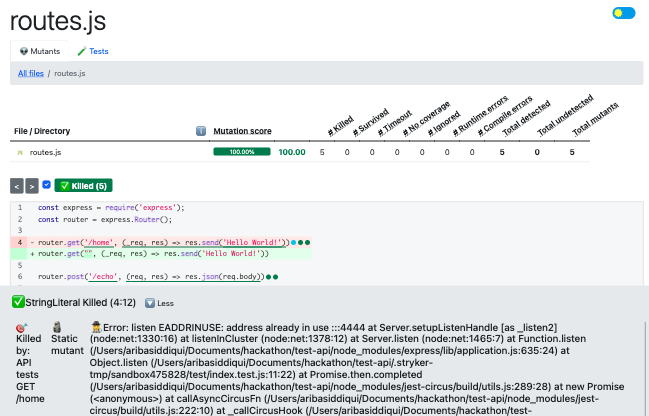
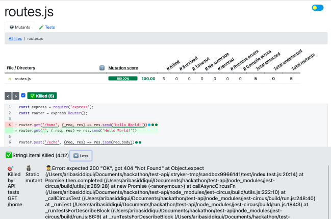

Stryker will always run checkers and test runners in parallel by creating worker processes (note, not `worker_threads`). The number of such processes forked is determined by the configuration option [`--concurrency`](./configuration.md#concurrency-number--string). You can specify a number (e.g., `4`) or a percentage of CPU cores (e.g., `"50%"`). 

However, imagine running these parallel processes on a test suite which uses resources like a database connection, web server or file system. This means these processes can conflict if they write to the same database, file or utilize the same port.

:::note 

Although Stryker creates a sandbox with a copy of the sources, this directory does not isolate test runners, since all test runners use the same files. If a test suite creates a file within the project directory it will be visible to all other test runners which can have unintended consequences.

:::

What exactly is this conflict? Let us dive deep. Assume an example of a simple application with two routes, namely - `GET /home` and `POST /echo`. The `GET` api returns a plain string 'Hello World!' (of course!) and the `POST` api returns in the response body the same as what is sent in the request body. 

```js
// routes.js

const express = require('express');
const router = express.Router();

router.get('/home', (_req, res) => res.send('Hello World!'))

router.post('/echo', (req, res) => res.json(req.body))

module.exports = router
```

We also have a test suite written for these routes: 

```js
// index.test.js

const server = require('../src/index.js');
const supertest = require('supertest');
 
describe("API tests", () => {
    
    let app;
    let port = 4444

     beforeAll(() => {
        app = server.listen(port);
     });

     afterAll(() => {
        app.close();
     });

    test("GET /home", async () => {
        await supertest(server).get("/home")
            .expect(200)
            .then((response) => expect(response.text).toBe('Hello World!'));
    });

    test("POST /echo - non-empty request body", async () => {
        const body = { "john": "doe", "marilyn": "monroe" }
        await supertest(server).post("/echo")
            .send(body)
            .expect(200)
            .then((response) => expect(response.body).toStrictEqual(body));
    });
    
});
```

Now if you run Stryker on this example, the results can be decieving. Some of the Stryker mutants get falsely killed in the process. This is precisely due to the error thrown by parallel mutant processes not being able to start the application on port `4444`, as it is already in use. 




 To solve this problem, Stryker sets a unique number (starting from 0 and incremented by 1) to each worker's environment variable `STRYKER_MUTATOR_WORKER`. This variable can be utilized to distribute the resources without conflicts - for instance, by setting the server port to `4444 + (+process.env.STRYKER_MUTATOR_WORKER)` instead of `4444`. 


```diff
-  let port = 4444
+  let port = 4444 + (+process.env.STRYKER_MUTATOR_WORKER || 0)
```

Running Stryker on the same example with the above change ensures no false kills.



